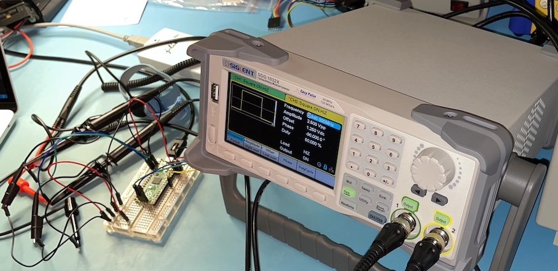

# QuadratureDecoder - PIO based Encoder Library for the RP2040


## Overview
The ```QuadratureDecoder``` C++ class can be used to count quadrature encoder signal transitions in the background using the RP2040's PIO and DMA hardware. The features of this class include:
* Keeping track of the quadrature encoder transitions without using any CPU cycles.
* Samples the encoder pins at 11.36 MHz (125 MHz / 11 PIO instructions).
  * Counts falling and rising edges encountered on both of the encoder signals.
  * Maximum encoder frequency supported is therefore 11.36MHz / 4 = 2.84MHz
  * The photo above shows a function generator setup to verify that this library does function up to the 2.84MHz limit.
* Each state machine in the PIO can be used to track an individual encoder so a single PIO can be used to track 4 encoders.

## Hardware Resources Utilized
* Most of one PIO instance is needed just for the program used by the state machines to count encoder transitions. It only leaves 4 instruction slots free.
* 1 PIO state machine for each 2-pin quadrature encoder to be counted.
* 1 DMA channel for each 2-pin quadrature encoder to be counted.

## How it Works
### PIO
```asm
; Must start at 0 so that the following jump table can be jumped into with a
; 'mov pc, isr' instruction.
.origin 0
    ; 16 element jump table based on 4-bit encoder last state and current state.
    jmp delta0      ; 00-00
    jmp minus1      ; 00-01
    jmp plus1       ; 00-10
    jmp delta0      ; 00-11
    jmp plus1       ; 01-00
    jmp delta0      ; 01-01
    jmp delta0      ; 01-10
    jmp minus1      ; 01-11
    jmp minus1      ; 10-00
    jmp delta0      ; 10-01
    jmp delta0      ; 10-10
    jmp plus1       ; 10-11
    jmp delta0      ; 11-00
    jmp plus1       ; 11-01
    jmp minus1      ; 11-10
    jmp delta0      ; 11-11

; Program actually starts here.
.wrap_target
delta0:
public start:
    mov isr, null       ; Make sure that the input shift register is cleared when table jumps to delta0.
    in y, 2             ; Upper 2-bits of address are formed from previous encoder pin readings
    mov y, pins         ; Lower 2-bits of address are formed from current encoder pin readings. Save in Y as well.
    in y, 2
    mov pc, isr         ; Jump into jump table which will then jump to delta0, minus1, or plus1 labels.
minus1:
    jmp x-- output      ; Decrement x
    jmp output
plus1:
    mov x, ~x           ; Increment x by calculating x=~(~x - 1)
    jmp x-- next2
next2:
    mov x, ~x
output:
    mov isr, x          ; Push out updated counter.
    push noblock
.wrap
```

#### X Register - 32-bit Count
The X register is used to track the current encoder count. Each time it is updated, its value is pushed out onto the state machine's RX FIFO.

#### Y Register - Previous 2-pin State
The Y register holds the previous 2-bit state of the encoder pins.

#### ISR
The input shift register is used to left shift in the previous 2-bit value of the encoder pins and the current 2-bit value of the encoder pins.

#### Jump Table
The 4-bit value in the ISR is used to index into the 16 element jump table at the beginning of the PIO program. Each element in the table will jump to the ```plus1```, ```minus1```, or ```delta0``` label depending on whether the encoder has transitioned clockwise, counter-clockwise, or not at all.

### DMA
The PIO state machine takes care of counting the encoder signal transitions and pushes out counter updates to its RX FIFO. Rather than using the CPU to constantly read out the counter updates from the FIFO, a DMA channel is used instead. It copies the latest count into the correct ```m_counters[]``` array element of the ```QuadratureDecoder``` object.

The DMA channel is configured to make 0xFFFFFFFF such transfers in the background. This does mean that it would stop working after 4,294,967,295 counter updates. To remedy that issue, the ```QuadratureDecoder::getCount()``` method will restart the DMA transfer once it has completed more than 2,147,483,648 transfers. My testing showed that this restart doesn't cause any missed encoder counts updates, even if the restart frequency is increased to once per second.
